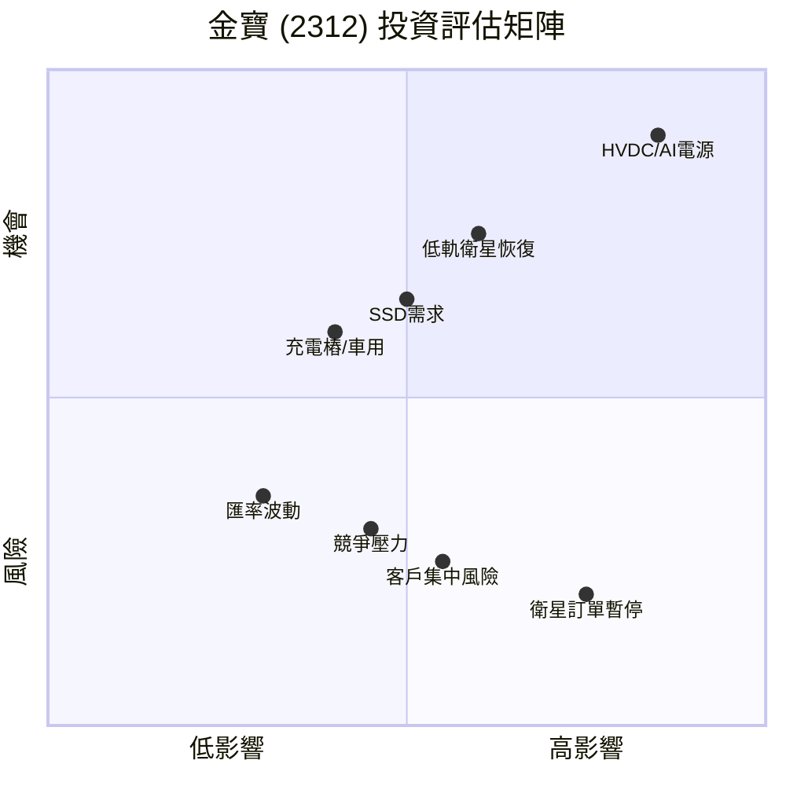

# 🔍 金寶電子 (2312.TW) 深度研究報告

> 研究日期：2026-02-23 ｜ 資料截至：2026-02-11 收盤

---

## 📋 公司基本資料

| 項目 | 內容 |
|------|------|
| 股票代號 | 2312.TW |
| 公司名稱 | 金寶電子工業股份有限公司 (Kinpo Electronics) |
| 產業類別 | 電子代工 / EMS |
| 主要業務 | 印表機、SSD、AI 伺服器主機板、低軌衛星地面基地台、IoT、車用電子 |
| 重要子公司 | 康舒科技 (AcBel Polytech, 6282)、泰金寶 |
| 近期收盤價 | NT$24.10（2/11） |
| 52 週高點 | NT$35.65（2026/1 月中旬，24 年新高） |

---

## 📊 財務數據總覽

### 營收趨勢

| 期間 | 營收 | 年增率 | 備註 |
|------|------|--------|------|
| 2025 全年 | NT$1,631.62 億 | -0.93% | 微幅衰退 |
| 2025 Q3 | NT$412.6 億 | 季+10.27%、年-10.34% | |
| 2025/12 月 | NT$135.13 億 | +3.32% | 稅後淨利年增 222.67% |
| 2026/1 月 | NT$130.61 億 | **-13.06%** | 受低軌衛星訂單暫停影響 |

### 獲利指標

| 期間 | EPS | 備註 |
|------|-----|------|
| 2025 Q1 | 0.35 元 | 近 39 季新高 |
| 2025 前三季 | 0.85 元 | 稅後純益 NT$12.7 億 |
| 2025 Q3 單季 | 0.30 元 | |
| 2025/12 月（自結） | 0.07 元 | |
| 法人預估 2025 全年 | ~1.43 元 | |

---

## 🚀 成長引擎分析

### 1. AI 伺服器 & HVDC 電源（⭐ 核心看點）

> [!IMPORTANT]
> 這是金寶集團 2026 年最重要的成長故事線

- **康舒科技**（子公司 6282）於 2026/1/21 正式發布 **1MW HVDC 電源系統**，專為 AI 資料中心設計
- 產品規格：100kW Power Shelf + BBU 備援模組，支援 ±400V/800V 輸出，達 80 PLUS **RUBY** 最高效率等級
- **33kW Power Shelf** 預計 2026 年量產出貨；**72kW** 進入客戶驗證
- AI 產品營收佔比目標：2025 年 ~20% → **2026 年 30%**
- 資料中心業務預估 **2-3 倍成長**
- 目標客戶：全球雲端服務供應商 (CSP)，對標台達電
- 金寶母公司負責提供全球製造能量與自動化產線支援

**趨勢背景**：全球 AI 伺服器 AC-DC 電源市場預計 2026-2034 年 CAGR 達 22.0%

### 2. 低軌衛星（⚠️ 重大變數）

> [!CAUTION]
> 此題材曾推動股價飆至 24 年新高，但目前已暫停

- 金寶為 **SpaceX 低軌衛星地面接收基地台**主機板與系統組裝供應商
- 具備泰國 & 墨西哥工廠產能優勢
- **2026/1 月底**：總經理陳威昌證實低軌衛星訂單**已暫停**
  - 原因：客戶（SpaceX）轉向自有工廠生產（垂直整合策略）
  - 與客戶合作關係未終止，未來仍有機會重啟
- 影響：投信單日大砍 5,684 張，股價 5 天暴跌 **23.45%**

**未來觀察點**：
- SpaceX 2027 年「太空資料中心」計畫可能帶動新一波硬體需求
- SpaceX 未來若啟動 IPO，可能擴大外包比例

### 3. SSD / 印表機（穩定基礎）
- SSD 需求強勁，為目前營收穩定成長動能之一
- 印表機持續出貨，屬傳統基本盤

### 4. 其他新佈局
- **充電樁**：DC 快充產品預計 2026 Q1 量產
- **車用電子**：持續佈局中
- **量子運算**：投資 NVIDIA 轉投資的量子新創 **SEEQC**
- **半導體設備主板**：新產品線陸續發酵

---

## 📈 技術面分析（截至 2/11）

### 均線系統

| 均線 | 價位 | 方向 | 與股價關係 |
|------|------|------|-----------|
| MA5 | 24.40 | ↓ | 壓力 |
| 月線 (MA20) | 28.05 | ↓ | 遠上方壓力 |
| 季線 (MA60) | 24.70 | ↑ | 近身壓力 |
| 半年線 (MA120) | 22.60 | ↑ | 支撐 |
| 年線 (MA240) | 21.35 | ↑ | 強支撐 |

### 技術指標

| 指標 | 數值 | 判讀 |
|------|------|------|
| KD | 低檔背離，連 4 天低檔鈍化 | 短期偏弱，但可能築底 |
| MACD | 低檔背離 | 下跌動能減緩 |
| RSI(14) | 55.6 | 中性 |

### 技術面結論

股價從高點 35.65 急殺至 24 元附近，跌幅約 33%。目前在**半年線 22.6 元**獲得強支撐，KD 和 MACD 同步出現**低檔背離**，暗示賣壓減緩。但短中期均線（MA5、月線）仍朝下，季線 24.7 元為近身壓力。若能放量站穩 24.7 元以上，有機會展開反彈修復行情。

---

## 💰 籌碼面分析（截至 2/11）

### 三大法人動態

| 法人 | 2/11 買賣超 | 近期趨勢 | 持股比例 |
|------|------------|---------|---------|
| **外資** | 買超 1,749 張 | 連 4 日買超 | 8.56%（128,854 張） |
| **投信** | 賣超 545 張 | 偏賣超 | — |
| **自營商** | 賣超 121 張 | 連 9 日賣超 | — |
| **合計** | 買超 1,083 張 | — | — |

### 籌碼判讀

> [!NOTE]
> 法人間看法出現明顯分歧：外資逢低佈局，投信和自營商持續調節

- 1 月底低軌衛星利空後，投信大量砍倉（單日 -5,684 張）
- 2 月起外資開始連續買超，可能認為利空已反映
- 投信仍偏賣超，反映短線信心不足

---

## 🎯 估值與目標價參考

| 來源 | 目標價/建議 | 基準 |
|------|-----------|------|
| 法人報告（2025/10） | ~NT$32 | 2025 EPS 1.43 × 18-22x PE |
| 分析機構（2026/1/13） | 長期強烈買入 | 止損 21.89 元 |

### 估值思考

- 若以 2025 年 EPS ~1.43 元計算：
  - 15x PE → NT$21.5（接近年線）
  - 18x PE → NT$25.7
  - 22x PE → NT$31.5
- 當前 24.1 元約 **16.9x PE**，位於歷史估值偏低區間
- **關鍵**：2026 年 EPS 能否因 HVDC/AI 題材向上跳升，決定了估值能否重新擴張

---

## ⚖️ SWOT 分析

### 🟢 優勢 (Strengths)
- 康舒 HVDC 產品技術領先，已進入全球 CSP 客戶驗證
- 泰國/墨西哥全球化工廠佈局，避開地緣政治風險
- 多元成長引擎（AI 電源 + SSD + 充電樁 + 車用）

### 🔴 劣勢 (Weaknesses)
- EPS 偏低，獲利能力仍待提升
- 傳統 EMS 代工毛利率偏薄
- 低軌衛星利空尚未完全消化

### 🟡 機會 (Opportunities)
- AI 資料中心 HVDC 電源市場高速成長（CAGR 22%）
- SpaceX IPO 或太空資料中心計畫可能重啟外包
- 充電樁、車用電子等新品線放量

### ⚫ 威脅 (Threats)
- SpaceX 持續垂直整合，衛星訂單可能長期暫停
- 台達電等強勁競爭對手在 AI 電源領域
- 新題材若未反映在實際營收與毛利，本益比有修正壓力

---

## 📝 投資結論與觀察重點

### 短期（1-3 個月）
- 股價在 22.6-24.7 元區間**整理築底**機率大
- 外資連續買超提供下檔支撐，但投信賣壓未止
- **關鍵價位**：站穩季線 24.7 元 → 偏多；跌破半年線 22.6 元 → 偏空

### 中期（3-6 個月）
- 康舒 33kW Power Shelf **量產出貨**為最大催化劑
- 2026 Q1 財報是否能展現 AI 題材的實質營收貢獻
- 低軌衛星訂單是否有任何復甦跡象

### 長期（6-12 個月）
- HVDC 成功打入 CSP 大客戶是最大想像空間
- 若 AI 電源營收佔比如期升至 30%+，EPS 可望明顯跳升
- 估值有從 17x 重回 20x+ PE 的潛力

> [!WARNING]
> **風險提醒**：分析師提醒，投資人需關注金寶的新題材是否能反映在**實際營收、毛利率和產品組合**上。若未來幾季財報數字未能跟上，當前因預期拉高的本益比可能面臨修正壓力。

---

*免責聲明：本報告僅供研究參考，不構成任何投資建議。投資有風險，請自行評估。*
