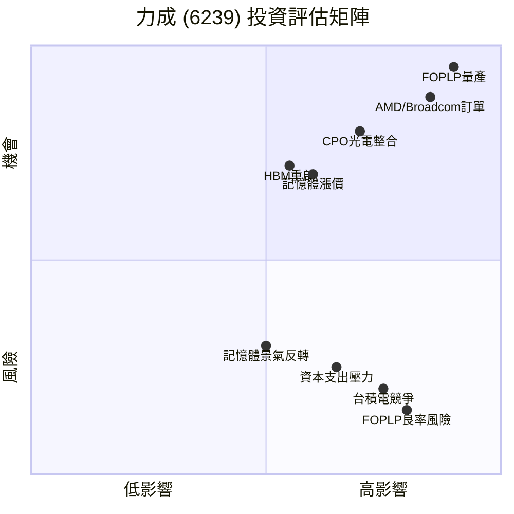

# 🔍 力成科技 (6239.TW) 深度研究報告

> 研究日期：2026-02-23 ｜ 資料截至：2026-02-11 收盤

---

## 📋 公司基本資料

| 項目 | 內容 |
|------|------|
| 股票代號 | 6239.TW |
| 公司名稱 | 力成科技股份有限公司 (Powertech Technology) |
| 產業類別 | 半導體封測 (OSAT) |
| 主要業務 | 記憶體封測（DRAM、NAND）、先進封裝（FOPLP、CPO）、HBM 封裝 |
| 重要客戶 | AMD、Broadcom、美光 (Micron)、鎧俠 (Kioxia) |
| 子公司 | 晶兆成（測試機台擴產） |
| 近期收盤價 | NT$243（2/11） |
| 市場地位 | 全球最大獨立記憶體封測廠 |

---

## 📊 財務數據總覽

### 營收趨勢

| 期間 | 營收 | 年增率 | 備註 |
|------|------|--------|------|
| 2025 全年 | NT$749.3 億 | — | |
| 2025 Q4 | NT$214.1 億 | — | |
| 2026/1 月 | NT$72.43 億 | **+43.04%** | 淡季不淡，強勁成長 |
| 2026E 全年 | 挑戰 **NT$1,000 億** | +33%+ | 董事長蔡篤恭目標 |

### 獲利指標與預估

| 期間 | EPS | 備註 |
|------|-----|------|
| 2025 Q1 | — | — |
| 法人預估 2025 全年 | 7.45 元 | FactSet 中位數 |
| **法人預估 2026 全年** | **10.87 - 14.26 元** | 年增 46.7%+，挑戰歷史新高 |

### 資本支出

| 年度 | 金額 | 用途 |
|------|------|------|
| 2026E | **NT$300-400 億** | FOPLP 產能擴建為主 |

> [!IMPORTANT]
> 2026 是力成的「投資大年」，400 億 capex 全力押注 AI 先進封裝，規模前所未見

---

## 🚀 成長引擎分析

### 1. FOPLP 扇出型面板級封裝（⭐⭐ 最大看點）

> [!IMPORTANT]
> 力成被視為全球僅 **兩家** 能做 5x Reticle 次世代 AI 晶片封裝的公司之一（另一家為台積電）

- **技術定位**：對標台積電 CoWoS，提供「類 CoWoS」先進封裝
- **面板尺寸**：510×515mm，比傳統晶圓級封裝更具面積與成本優勢
- **應用領域**：AI-CPU、ASIC-PU、光學引擎
- **客戶**：**AMD、Broadcom** 為核心客戶（2026/2 尾牙雙方代表出席）
  - 被視為「無法獲得台積電 CoWoS 產能」的客製化 ASIC 客戶首選
- **產能時程**：
  - P11 廠無塵室：2026 H1 完工
  - 首批 3,000 片/月設備：2026 年 7-8 月安裝
  - 剩餘 3,000 片設備：2027 Q1-Q2 到位
  - 目標月產能：**6,000 片面板**
- **營收貢獻**：2026 年認證 + 小量生產 → **2027 年量產** → 2028 年大幅放量
- 購入友達 (AUO) 廠房作為 P12 擴充基地

### 2. CPO 共同封裝光學（⭐ 次世代技術）

- FOPLP 技術已成功延伸至 CPO 領域
- 涵蓋：AI 晶片大型化封裝 + 光學引擎封裝 + 光電整合封裝
- **CPO 量產預計 2027 年底啟動**
- 切入 AI 晶片與光電整合，為下一代資料中心互連解決方案

### 3. HBM 高頻寬記憶體封裝

- 現有 HBM 產能 ~2,000 片/月
- 產能因 FOPLP 優先策略暫時轉作他用
- **2026 年暫緩 HBM 新案開發**（集中資源衝 FOPLP）
- 預計 **2027 年重啟** HBM 新客戶與新專案
- HBM 熱潮間接利好：帶動標準 DRAM 封測訂單回流

### 4. 傳統記憶體封測（穩定基礎）

- 主要客戶：美光 (Micron)、鎧俠 (Kioxia)
- DRAM/NAND 進入上升週期
- 封測報價已**調漲高達三成**，2026 Q1 起反映財報
- AI 營收佔比：Q1 4% → 近期 8%，持續上升

---

## 📈 技術面分析（截至 2/11）

### 股價概況

| 項目 | 數值 |
|------|------|
| 收盤價 | NT$243 |
| 當日漲幅 | +1.25%（+3 元） |
| 日內區間 | 236.5 - 244 |

### 技術面判讀

- 整體格局：**量價配合、多頭格局完整**
- 股價站穩各均線之上，呈現多頭排列
- 短中長期均線方向一致向上

---

## 💰 籌碼面分析

### 三大法人動態（截至 2/11）

| 法人 | 近期動向 | Q1 累計 |
|------|---------|--------|
| **外資** | 2/11 買超 675 張、2/9 買超 1,275 張 | **+21,764 張**（大幅買超） |
| **投信** | 2/11 賣超 297 張（短線微調） | **+9,364 張**（累計買超） |
| 合計 | — | 法人持續站在買方 |

### 籌碼判讀

> [!NOTE]
> 外資 Q1 累計買超超過 2 萬張，投信也累計買超近萬張，**法人共識偏多頭**

- 外資曾單日買超 5,651 張推升股價
- 2026 年 1 月外資累計買超 19,675 張
- 籌碼面「友善」，法人明顯站在買方

---

## 🎯 估值與目標價

### 法人目標價彙整

| 來源 | 目標價 | 評等 | 基準 |
|------|-------|------|------|
| 外資機構 | NT$220 | — | 記憶體需求 + FOPLP |
| 本土券商 A | **NT$307** | 買進（上修） | AI/HPC + FOPLP 進度 |
| 本土券商 B | **NT$320** | 買進 | 強勁記憶體 + AI 題材 |
| FactSet 中位數 | **NT$303.5** | — | 10-11 位分析師共識 |

### 估值思考

- 若以 2026E EPS 10.9 元計算：
  - 20x PE → NT$218
  - 25x PE → NT$273
  - **30x PE → NT$327**（先進封裝溢價）
- 當前 243 元約 **22.3x 2026E PE**
- FOPLP 若於 2027 年成功量產，2027E EPS 可能跳升至 15+ 元
  - 以 25x forward PE 計算 → NT$375+
- **關鍵**：市場是否願意給予「先進封裝平台轉型」的估值溢價

---

## ⚖️ SWOT 分析

### 🟢 優勢 (Strengths)
- 全球僅兩家具備 5x Reticle AI 晶片封裝能力
- AMD、Broadcom 等一線客戶深度合作
- 記憶體封測龍頭地位穩固，與 Micron/Kioxia 長期綁定

### 🔴 劣勢 (Weaknesses)
- FOPLP 2026 年仍在認證階段，大規模營收貢獻要等 2027
- 高額 capex（400 億）帶來短期財務壓力
- HBM 業務暫緩，短期讓出部分市場機會

### 🟡 機會 (Opportunities)
- 非台積電體系客戶對先進封裝的強烈需求（CoWoS 產能不足）
- CPO 光電整合為下一代資料中心核心技術
- 記憶體封測報價調漲 30%，直接推升毛利率
- 2027 年 FOPLP + CPO 雙引擎啟動，營收有望突破千億

### ⚫ 威脅 (Threats)
- FOPLP 良率未達預期可能延後量產時程
- 台積電持續擴充 CoWoS 產能，壓縮替代方案空間
- 記憶體景氣若反轉，傳統封測業務將受衝擊
- 地緣政治風險影響半導體供應鏈

---

## 📝 投資結論與觀察重點

### 短期（1-3 個月）
- 股價 NT$243 處於多頭格局，法人大幅偏多
- 2026 Q1 財報將反映**封測報價調漲 30%** 的效果
- 1 月營收年增 43% 已為強勁開局

### 中期（3-6 個月）
- P11 廠無塵室完工 + 首批設備安裝（2026 年中）為重大里程碑
- FOPLP 客戶認證進度是關鍵催化劑
- 2026E EPS 若確認站上 10 元，估值仍有上修空間

### 長期（6-12 個月）
- **2027 年 FOPLP 量產** 是最大的價值釋放時刻
- CPO 量產啟動將開啟全新成長維度
- 若成功轉型為「AI 先進封裝平台」，估值將從傳統 OSAT 的 15-20x PE 跳升至 25-30x PE

> [!TIP]
> **核心投資邏輯**：力成正從「傳統記憶體封測代工廠」轉型為「AI 先進封裝平台」。2026 年是關鍵的**投資建設年**，2027 年將迎來**收割年**。目前法人共識偏多，FactSet 目標價中位數 NT$303.5，仍有 ~25% 上行空間。

> [!WARNING]
> **風險提醒**：FOPLP 技術尚在驗證階段，良率與量產時程存在不確定性。400 億 capex 若無法如期轉化為營收，將對公司財務造成壓力。

---

*免責聲明：本報告僅供研究參考，不構成任何投資建議。投資有風險，請自行評估。*
